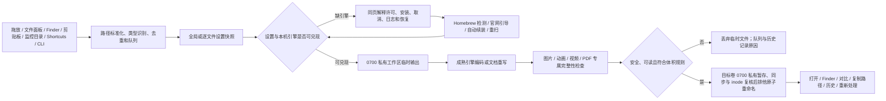

# SlimLuma 全面竞品对比（2026-07-28）

## 结论

SlimLuma 当前已经从“功能有竞争力、产品链路未闭环”推进到：

> 免费下载、源码公开可审阅、本地运行，能同时处理图片、动画、视频和 PDF，并对
> 结果做类型专属完整性守门的原生 macOS 压缩工作台。

上一轮识别出的五个高频缺口已经补齐：

1. 图片目标大小与 H.264 / HEVC 两遍目标大小；
2. 队列内逐文件设置；
3. 确定进度、ETA 和真正暂停 / 继续；
4. Homebrew 缺失时的官网引导、持续检测和安装续跑；
5. Developer ID、Hardened Runtime、Universal 构建、Apple 公证脚本及实机 UI /
   RTL / 对比窗口验收。

因此，SlimLuma 已达到直接竞品的核心功能基线，并在安全落盘、失败解释、PDF
结构保护、视频语义检查、许可透明和零订阅成本上有明确差异。它仍不应宣称在所有维度
领先：Clop 的无感自动化和回滚、Compresto 的轻量 Drop Zone、Permute 的转换广度、
ImageOptim 的多编码器竞争、HandBrake 的视频专业参数、PDF Squeezer 的 Inspector
与危险对象精细删除仍然更强。

## 对比方法与证据边界

产品按用途分为四层：

| 层级 | 产品 | 纳入原因 |
| --- | --- | --- |
| 直接竞品 | Clop、Compresto | 原生 macOS，多类型本地压缩与快速投放 |
| 相邻产品 | Permute | 通用媒体转换和轻编辑 |
| 专项标杆 | ImageOptim、HandBrake、PDF Squeezer | 图片、视频、PDF 的专业深度 |
| 专业上限 | Apple Compressor | 专业视频交付、HDR、监控目录与分布式编码 |

SlimLuma 结论来自当前源码、120 项测试、真实文件回归、签名包和解锁 Mac 上的实机
可访问性树与截图。竞品能力来自 2026-07-28 检查的官方产品页、帮助、App Store 或
官方 GitHub。没有在同一台 Mac 上用同一组素材跑全部竞品，所以本报告不做压缩率、
速度、功耗或主观画质排名。

图例：

- `●`：当前强能力；
- `○`：已支持，但范围较窄或仍有边界；
- `—`：未支持或不适用；
- `?`：当前官方资料不足，避免推测。

## 全局能力矩阵

| 能力 | SlimLuma | Clop | Compresto | Permute | ImageOptim | HandBrake | PDF Squeezer |
| --- | ---: | ---: | ---: | ---: | ---: | ---: | ---: |
| 图片压缩 / 转换 | ● | ● | ● | ● | ● | — | — |
| GIF / 动画保护 | ● | ● | ● | ● | ● | — | — |
| 视频压缩 | ● | ● | ● | ● | — | ● | — |
| PDF 压缩 | ● | ● | ● | — | — | — | ● |
| 独立音频转换 | — | ○ | ? | ● | — | ● | — |
| 图片目标大小 | ● | ○ | ? | ? | — | — | — |
| 视频目标大小 / 两遍编码 | ● | ○ | ? | ? | — | ● | — |
| 混合类型批处理 | ● | ● | ● | ● | — | — | — |
| 队列逐文件设置 | ● | ○ | ● | ● | — | ● | ● |
| 暂停 / 继续 / ETA | ● | ○ | ● | ● | ○ | ● | ○ |
| 预设 | ● | ● | ● | ● | ○ | ● | ● |
| 预设导入 / 导出 | ● | ○ | ? | ● | — | ● | ● |
| 自动监控目录 | ● | ● | ● | ● | — | — | ● |
| 剪贴板 | ● | ● | ? | — | — | — | — |
| Finder / Quick Action | ● | ● | ● | ● | ● | — | ● |
| Shortcuts | ● | ● | ● | ● | — | — | ● |
| CLI | ● | ● | ? | ○ | ● | ● | ● |
| 结果并排对比 | ● | ○ | ● | ● | — | ● | ● |
| 失败后解释与恢复入口 | ● | ● | ● | ○ | ○ | ● | ● |
| 默认不覆盖原件 | ● | — | ● | ● | — | ● | ● |
| 原地处理后的备份 / 回滚 | 不需要 | ● | ? | ? | — | — | — |
| 图片结构 / 动画逐帧守门 | ● | ? | ? | ? | ○ | — | — |
| 视频轨道 / 章节 / HDR 守门 | ● | ? | ? | ? | — | ○ | — |
| PDF 结构 / 加密守门 | ● | ? | ? | — | — | — | ○ |
| PDF 密码闭环 | ● | ? | ? | — | — | — | ● |
| PDF Inspector / 危险对象删除 | — | — | — | — | — | — | ● |
| 多编码器候选竞争 | — | ○ | ? | ? | ● | ○ | ○ |
| 完全本地媒体处理 | ● | ● | ● | ● | ● | ● | ● |
| 项目源码许可 | 当前保留全部权利；0.2.0 为 MIT | GPLv3 | 专有 | 专有 | GPLv2+ | GPLv2/BSD | 专有 |
| 20 locale / RTL | ● | ? | ○ | ● | ○ | ● | ● |

`不需要回滚` 不是缺少错误恢复：SlimLuma 从不把原件放进覆盖路径，失败输出只存在于
隐藏临时文件，验证失败后直接丢弃。它因此不需要为“已破坏的原文件”设计回滚；若未来
增加原地模式，回滚才会变成必需能力。

## SlimLuma 当前能力深度

### 图片与动画

- JPEG、PNG、WebP、AVIF、HEIC、GIF、TIFF、BMP、JPEG 2000 等常见输入；
- 格式、质量、无损、尺寸、元数据、ICC 和 WebP / AVIF 编码强度；
- 目标大小会反复从原件编码，逐级调整质量，必要时缩小尺寸；
- “移除全部元数据 + 保留 ICC”会先提取 profile，清理后再恢复；
- 动画重新解码每一帧，并比较帧数、逐帧时长和循环设置；
- 无法可靠兑现的无损、格式或元数据组合在运行引擎前就被拦截。

ImageOptim 仍领先于“多个成熟优化器同时产出候选、保留最小者”以及单优化器的超时、
速度和文件属性策略。SlimLuma 当前更偏向可解释的一条确定路径。

### 视频

- H.264、HEVC、AV1，软件编码与 VideoToolbox；
- 分辨率、帧率、质量、速度、音频码率、元数据和章节策略；
- H.264 / HEVC 目标大小使用两遍编码，并为音频、字幕和容器预留空间；
- FFmpeg 只有与同目录 ffprobe 同时可用才标记就绪；
- 确定进度、阶段、ETA、暂停、继续和取消都直接控制受管子进程；
- 输出检查时长、视频 / 音频 / 字幕轨道、语言、默认 / 强制 disposition、章节、
  字幕包和 HDR 色彩标记。

HandBrake 仍领先于音轨逐条编辑、直通与混音、字幕烧录、裁剪、去隔行、降噪、
色彩空间、profile / level / tune、短片段预览和专业 Activity Log。SlimLuma 的
目标是安全压缩，不是替代专业转码工作站。

### PDF

- 无损、均衡、极致、自定义四种目标；
- 自动、qpdf、Ghostscript 三种选择，界面按实际后端禁用无效参数；
- qpdf 修复 → Ghostscript 图片压缩 → 可选 qpdf 线性化；
- 加密密码不持久化到历史、预设或应用日志，通过权限 `0600` 的临时文件传递；
- 输出恢复原加密策略，再次解锁验收后清理临时凭据；
- 比较页数、书签、链接 / 批注、表单、签名字段、加密、可搜索文本和线性化；
- 数字签名字段、结构退化或灾难性文本丢失会拒绝输出；
- Quick Look 并排比较可通过关闭按钮或 Escape 退出。

PDF Squeezer 仍领先于 PDF Inspector、多配置候选、字体 / 对象 / 内容流级精细处理、
图片导出和全屏比较。它允许删除结构树、链接、表单、Output Intent 等对象；这些
功能很强，但也可能破坏交互、可访问性、签名或印刷语义，SlimLuma 不把它们作为普通
用户默认基线。

## 产品闭环

关键恢复路径也闭环：

- Homebrew 不存在：打开官方安装页，应用持续检测；Homebrew 就绪后自动继续之前
  选择的引擎安装。应用不会冒充自己安全安装了 Homebrew；
- 引擎部分损坏：例如 FFmpeg 缺 ffprobe，会显示“部分失效”并使用 reinstall；
- 任务暂停：进程真正挂起，继续后沿原任务执行，取消会终止受管子进程；
- 自动导入遇到忙碌批次：请求排队，当前批次结束后续跑；
- 结果不变小：默认不生成，也可显式保留，并在队列与历史中标注；
- 完整性失败：临时输出不进入最终目录，原因留在队列和历史；
- 比较窗口：关闭按钮、Escape 和系统窗口关闭均能退出；
- 重新处理：重置结果并立即开始新批次，不要求再点第二次开始。

Homebrew 本身仍是明确的外部边界：让第三方应用静默执行 Homebrew 官方安装脚本既不
透明也不安全，因此“打开官网 → 检测 → 自动续装”是产品闭环，而不是未完成的按钮。

## macOS UI 与交互

实机审计结论：

- 单窗口 `NavigationSplitView`、原生侧栏、菜单、文件面板、拖放和 Quick Look
  符合 macOS 模型；
- 添加文件、扫描目录、剪贴板导入和队列清空都位于“媒体压缩”工作区，不再作为
  右上角全局应用操作；
- 图片、视频、PDF 和预设是有边框、选中态、图标和标准菜单的真实控件，不再像灰色
  用户提示；
- 批次开始后设置锁定，避免用户误以为运行中修改会影响已经启动的文件；
- 删除、清空、取消、退出、比较关闭和重新处理都有明确终点；
- `Command-O`、`Command-Shift-O`、`Command-Return`、`Command-.` 和 Escape
  覆盖高频键盘路径；
- 阿拉伯语实机确认了 RTL：首个媒体类型在最右、标签在右而控件在左、原理步骤从
  右侧 1 走到左侧 5；隐藏和恢复侧栏不再触发 AppKit 约束崩溃；
- 简体中文主工作区在真实 macOS 深色外观下复验后恢复了用户原来的浅色外观；
- 可访问性树中的媒体类型、原理流程和操作按钮保持语义顺序。

证据：

- [简体中文主界面](release-audit-2026-07-28/22-main-zh-Hans-final.png)
- [阿拉伯语 RTL 主界面](release-audit-2026-07-28/20-main-ar-rtl-final.png)
- [阿拉伯语 RTL 原理流程](release-audit-2026-07-28/21-principles-ar-rtl-final.png)
- [简体中文暗色主界面](release-audit-2026-07-28/23-main-zh-Hans-dark-final.png)
- PDF 对比窗口使用合成测试文档完成了关闭按钮、Escape 和系统窗口关闭验证。为避免
  在公开仓库披露用户文档名称与内容，原始实机截图已从当前版本及 Git 历史中移除。

这不等于已经完成 20 种语言的母语视觉编辑，也不等于完整 VoiceOver 朗读会话或所有
显示器尺寸的截图矩阵；它证明了核心原生交互、键盘关闭、RTL 排列与可访问性树闭环。

## 国际化与 GitHub

- 18 个语言层、20 个 locale；
- 每个 locale 903 个主文案 key、9 个 CLDR 复数 key；
- Finder Services、Info.plist、App Shortcuts 和运行时错误都在相同 locale 集内；
- 阿拉伯语、乌尔都语和 Shahmukhi 西旁遮普语使用 RTL；
- 文件名、路径、用户预设名和外部引擎日志不翻译；
- GitHub 使用英文默认 README、完整简体中文镜像和 20 份语言入口；
- 每个正式版本生成 20 份本地化版本说明，并在首屏提供 DMG 直接下载；
- 生成器与 CI 会拒绝过期版本、locale 漂移、下载链接漂移和相对链接断裂；
- PR 模板、Issue 表单、发布说明、贡献、安全、支持和行为准则提供国际化入口。

资源完整、运行时可解析、没有残留中文 / 生成器 token / 英文占位副本，并不等于
每一种语言已经达到母语营销文案水平。面向特定市场投放前仍应安排母语编辑。

## 发布成熟度

| 门禁 | 当前状态 |
| --- | --- |
| Swift 测试 | 120 项，1 项外部 PDF 环境测试在未传 fixture 时按设计跳过 |
| 代表性私有 PDF | 压缩后明显变小，页面、书签与关键结构均通过完整性检查；不公开样本指纹 |
| Universal | `arm64` + `x86_64` |
| App / CLI 分离 | 构建产物和打包门禁拒绝二者误用同一二进制 |
| Developer ID | 已签名 |
| Hardened Runtime / 时间戳 | 已启用并验证 |
| 20 locale / App Intents | 已进入 app bundle 并通过打包门禁 |
| Apple 公证 | app、CLI 与 DMG 均已在本轮获得 `Accepted` |
| DMG / ZIP / CLI / SHA-256 | 已生成；DMG staple 后已重新计算并逐项校验 |
| GitHub 公开发行 | `v0.2.0` 已公开；4 个附件可匿名下载，哈希及下载后 DMG Gatekeeper 已复核 |

0.2.0 已完成本地签名、公证、Gatekeeper、校验和以及 GitHub 公开发布。未来版本仍
必须分别通过 tag、Actions、Release 附件和下载后 Gatekeeper 抽查，不能复用本版本
结论。

## 商业、许可与隐私

| 产品 | 当前商业模式 | 代码 / 数据边界 |
| --- | --- | --- |
| SlimLuma | 免费下载 | 当前开发版本保留全部权利、源码仅公开审阅；0.2.0 历史版本为 MIT；媒体、本地历史和密码不上传；外部引擎独立许可 |
| Clop | 免费层 + €15 Pro 终身许可 | GPLv3；本地处理；原地优化保留备份 |
| Compresto | Personal $49；Standard 当前 $69，一次性，也有订阅 | 商业软件；官方主压缩流程本地 |
| Permute | 付费 / Setapp | 商业软件；通用本地媒体转换 |
| ImageOptim | 免费 | GPLv2+；图片专项 |
| HandBrake | 免费 | GPLv2 / BSD；视频专项 |
| PDF Squeezer | 官网 $19.99，当前促销 $9.99 / €9.99 | 商业软件；PDF 本地处理 |
| Apple Compressor | App Store $49.99 | 商业软件；Apple 专业视频工具 |

价格只代表 2026-07-28 官方页面，可能随地区、税费和促销变化。

## 仍然存在的竞争差距

### 值得继续做

1. 图片多编码器候选竞争，并解释速度、大小和最终选中原因；
2. 视频 10–30 秒抽样预览、逐音轨策略和更完整 Activity Log；
3. PDF Inspector 与多个安全预设候选比较；
4. 默认关闭、明确显示当前预设的菜单栏 / Drop Zone；
5. 更完整的 VoiceOver 朗读、全页面深色模式和母语 GUI 审校矩阵；
6. 发布后的自动更新与升级兼容策略。

### 只在明确需求下扩展

- 独立音频压缩、视频转 GIF、快速裁剪；
- URL 回调、Raycast、计划任务和完成后休眠；
- 动态命名、Finder 标签和可选本地智能命名。

### 不作为核心基线

- OCR、TTS、HLS、IP 摄像机修复；
- 完整 ProRes / 广播交付 / 分布式编码；
- 无限制 Raw FFmpeg；
- 默认云端 AI；
- 默认删除 PDF 链接、表单、结构树、Output Intent 或可访问性信息。

## 最终定位

以 Compresto 为直接功能和队列体验基线，以 Clop 为自动化体验基线，以
ImageOptim、HandBrake、PDF Squeezer 为专项深度上限；SlimLuma 自己的护城河是：

1. 不覆盖原件的安全落盘；
2. 不把“生成文件”冒充“压缩成功”的完整性守门；
3. 透明的引擎、后备与许可边界；
4. 免费下载、源码公开可审阅、本地处理和 20 locale；
5. GUI、Finder、Shortcuts 与 CLI 共用同一条安全压缩链路。

官方竞品来源：

- [Clop](https://lowtechguys.com/clop/)
- [Compresto](https://compresto.app/) 与
  [定价](https://compresto.app/pricing)
- [Permute](https://software.charliemonroe.net/permute/)
- [ImageOptim](https://imageoptim.com/mac) 与
  [偏好设置](https://imageoptim.com/en/prefs.html)
- [HandBrake 功能](https://handbrake.fr/features.php) 与
  [队列](https://handbrake.fr/docs/en/latest/advanced/queue.html)
- [PDF Squeezer](https://www.witt-software.com/pdfsqueezer/)
- [Apple Compressor](https://apps.apple.com/us/app/compressor/id424390742?mt=12)
